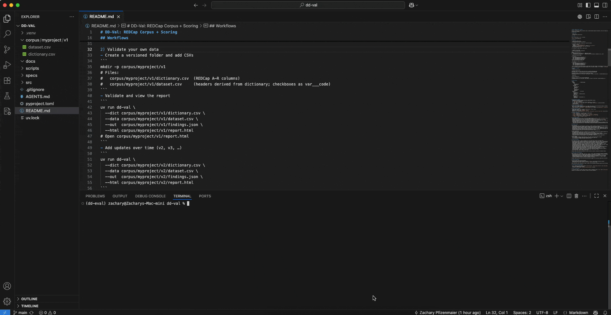
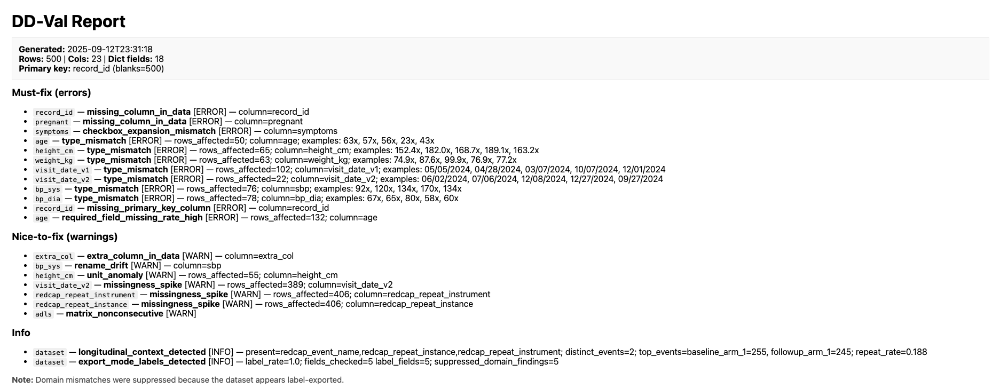
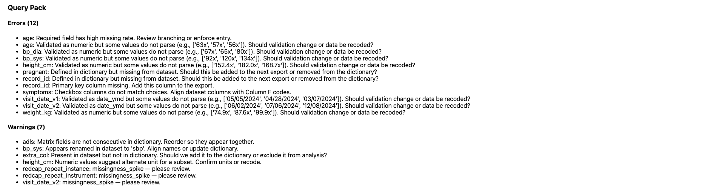

# DD‑Val: Data Dictionary Validator for REDCap

DD-Val is a command-line tool that automates the tedious process of validating REDCap datasets against their data dictionaries, turning weeks of back-and-forth into a single, actionable report.

Generate a deterministic REDCap evaluation corpus, validate datasets against dictionaries, and score findings against a gold standard. Ships with a reference validator (`dd-val`) and supports bring‑your‑own validator.

## 🖥️ Demo

Here's a quick demo of `dd-val` in action:



### Sample Report





## Requirements

- Python 3.10+
- uv (https://docs.astral.sh/uv/)

## Workflows

1) Explore the seeded corpus
- Seed sample data (10 projects × 500 rows)
```
uv run dd-seed --out corpus --projects 10 --rows 500 --seed 42
```
- Validate all projects
  - Windows: `./scripts/validate_all.ps1`
  - macOS/Linux: `scripts/validate_all.sh` (defaults to `uv run dd-val`)
- View results: open each `report.html` next to its CSVs
- Score perturbed runs vs gold
```
uv run dd-score --corpus corpus --mode variable
```

2) Validate your own data
- Create a versioned folder and add CSVs
```
mkdir -p corpus/myproject/v1
# Files:
#   corpus/myproject/v1/dictionary.csv  (REDCap A–R columns)
#   corpus/myproject/v1/dataset.csv     (headers derived from dictionary; checkboxes as var___code)
```
- Validate and view the report
```
uv run dd-val \
  --dict corpus/myproject/v1/dictionary.csv \
  --data corpus/myproject/v1/dataset.csv \
  --out  corpus/myproject/v1/findings.json \
  --html corpus/myproject/v1/report.html
# Open corpus/myproject/v1/report.html
```
- Add updates over time (v2, v3, …)
```
uv run dd-val \
  --dict corpus/myproject/v2/dictionary.csv \
  --data corpus/myproject/v2/dataset.csv \
  --out  corpus/myproject/v2/findings.json \
  --html corpus/myproject/v2/report.html
```
`dd-val` auto‑links to the previous version by folder name (vN → vN‑1) and emits “since‑last‑run” info (e.g., new columns or added domain values). For arbitrary names (dates/tags), add a `.prev` file inside the folder pointing to the previous findings (file or directory). Example `.prev` content: `../v1/findings.json`.

## Validate all (batch)
- Windows
```
./scripts/validate_all.ps1

# Optional: strict clean runs (fail if any errors in folders without gold.json)
$env:CLEAN_STRICT=1; ./scripts/validate_all.ps1; Remove-Item Env:\CLEAN_STRICT

# Optional: use your own CLI (preserve {dict} {data} {out} {html})
$env:VALIDATOR_CMD='your-cli --dict {dict} --data {data} --out {out} --html {html}'; ./scripts/validate_all.ps1; Remove-Item Env:\VALIDATOR_CMD
```
- macOS/Linux
```
scripts/validate_all.sh

# Optional: use your own CLI by setting VALIDATOR_CMD
# VALIDATOR_CMD='your-cli --dict {dict} --data {data} --out {out} --html {html}' scripts/validate_all.sh
```

## Folder layout
```
corpus/
  proj01/                 # seeded example
    clean/
      v1/
        dictionary.csv
        dataset.csv
    perturbed/
      v1/
        dictionary.csv
        dataset.csv
        gold.json
      v2/
        dictionary.csv
        dataset.csv
        gold.json
  myproject/              # your data
    v1/
      dictionary.csv
      dataset.csv
      findings.json   # created by dd-val
      report.html
    v2/
      dictionary.csv
      dataset.csv
      findings.json   # auto‑linked to v1
      report.html
```

## Since‑last‑run linking
- Purpose: add informational findings describing changes between versions.
- Precedence for previous findings:
  1) `--prev <path>` (explicit)
  2) `.prev` file in the folder (path to previous findings or its folder)
  3) Folder naming (`vN` → `vN‑1`; also `_vN` → `_vN‑1`; seeded `*_perturbed_vN` → previous perturbed)
  4) None (no diffs)
- Disable entirely with `--no-prev`.

## Clean runs (optional noise gate)
- What: treat any folder without `gold.json` as “clean”; fail the run if any error‑severity finding is produced.
- When: use for validator development/CI to guard against false positives.
- Enable: macOS/Linux `CLEAN_STRICT=1 ... scripts/validate_all.sh`; Windows `$env:CLEAN_STRICT=1; ./scripts/validate_all.ps1`.

## Bring your own validator
- Output format: JSON array of findings, or object with a `findings` array.
- Required per finding: `type`, `variable`.
- Optional for strict scoring: `expected`, `observed`.
- Batch run: set `VALIDATOR_CMD='your-cli --dict {dict} --data {data} --out {out} --html {html}'` and use the validate‑all script for your OS.

## Commands (reference)
- `dd-seed`: generate clean + perturbed corpora (nested layout)
  - `--out`, `--projects`, `--rows`, `--seed`
- `dd-val`: validate dataset vs dictionary; write `findings.json` + `report.html`
  - `--dict`, `--data`, `--out`, `--html`, `--prev`, `--no-prev` (or `.prev` file)
- `dd-score`: score predictions vs gold across the corpus
  - `--corpus`, `--mode` = `variable` | `strict`

## Info section details
- extra_column_since_last_run (info): Lists the new dataset column (as `column=...`) and `rows_affected` (all rows for a new column).
- domain_mismatch_since_last_run (info): Lists newly added allowed codes (as `added=...`).
- missing_column_since_last_run (info): Column present in the previous run is now absent from the dataset.
- validation_changed_since_last_run (info): The dictionary validation changed for a variable (e.g., `integer` to `number`).
- required_flag_changed (info): The dictionary required flag changed for a variable.
- These appear under the “Info” section in the HTML report and never cause failures.
 - export_mode_labels_detected (info): Dataset appears to contain labels instead of codes for categorical fields. Domain mismatch noise is suppressed; re-export in raw (codes) is recommended.
 - longitudinal_context_detected (info): Standard REDCap longitudinal/repeating columns detected; these are recognized and not treated as extra columns.

## Validator checks

Errors (must‑fix)
- missing_column_in_data: Column defined in dictionary is absent in dataset (includes missing checkbox expansions `var___code`).
- checkbox_expansion_mismatch: Checkbox columns in dataset do not match Column F choices.
- type_mismatch: Values fail declared validation (integer, number, date_ymd, date_mdy, datetime_ymd). Includes examples and rows_affected.
- domain_mismatch: Observed categorical codes not in allowed choices (Column F). Shows expected pairs like `0=Male`.
- missing_primary_key_column: Primary key column missing (uses `record_id` if present, else first dictionary variable).
- duplicate_primary_key_values: Duplicate values in the primary key column.
- required_field_missing_rate_high: A dictionary‑required field has a high missing rate.

Warnings (nice‑to‑fix)
- extra_column_in_data: Column exists in dataset but not in dictionary (rename hints and checkbox expansions are excluded).
- missingness_spike: High blank rate (>=70%) for a column with >=50 rows.
- unit_anomaly: Heuristic unit issue (e.g., notes say `units=cm` but subset looks like inches).
- branching_mismatch: Values appear outside branching logic (minimal example: pregnant outside sex constraint).
- matrix_nonconsecutive: Matrix group fields are not consecutive in dictionary.
- rename_drift: Dictionary variable appears to have been renamed in dataset (uses simple rename hints).

Severity meanings
- error: Must‑fix. Included in Query Pack Errors. Fails clean runs when noise gate is enabled.
- warn: Nice‑to‑fix. Included in Query Pack Warnings. Does not fail clean runs.
- info: Since‑last‑run insights (see below). Never fails runs.

## Query Pack wording

Each finding also renders a single, actionable line in the “Query Pack” section of the HTML report:
- missing_column_in_data: “Defined in dictionary but missing from dataset. Add to next export or remove from dictionary?”
- extra_column_in_data: “Present in dataset but not in dictionary. Add to dictionary or exclude from analysis?”
- domain_mismatch: “Observed values … not in allowed codes …. Map these or revise Column F choices?”
- type_mismatch: “Validated as <type> but some values do not parse (e.g., …). Change validation or recode?”
- unit_anomaly: “Numeric values suggest alternate unit for a subset. Confirm units or recode.”
- checkbox_expansion_mismatch: “Checkbox columns do not match choices. Align dataset columns with Column F codes.”
- missing_primary_key_column: “Primary key column missing. Add this column to the export.”
- duplicate_primary_key_values: “Duplicate primary key values exist. Deduplicate or fix export.”
- required_field_missing_rate_high: “Required field has high missing rate. Review branching or enforce entry.”
- export_mode_labels_detected: “Dataset appears label‑exported. Re‑export in raw (codes) or map labels.”
- rename_drift: “Appears renamed in dataset to '<new>'. Align names or update dictionary.”
- matrix_nonconsecutive: “Matrix fields are not consecutive in dictionary. Reorder so they appear together.”
- branching_mismatch: “Values appear outside branching logic. Confirm logic or data.”
- Other types render a generic “please review” line.

Ordering: Query Pack entries are grouped by variable (sorted by variable, then type) to streamline triage.

## Info section (since‑last‑run)

When a previous run is linked (auto, `.prev`, or `--prev`), `dd-val` emits informational findings to highlight changes since the last run:
- extra_column_since_last_run: New dataset column compared to the previous run. Includes rows_affected and where.dataset_column.
- missing_column_since_last_run: Column present previously is now absent from the dataset.
- domain_mismatch_since_last_run: Newly added allowed choice codes in the dictionary. Lists observed_added.
- validation_changed_since_last_run: Dictionary validation changed for a variable (e.g., integer → number).
- required_flag_changed: Dictionary required flag changed for a variable.

Purpose: These info items are not errors; they surface what changed to aid review and release notes. They never cause failures and appear in the “Info” section of the HTML report.

## Summary enhancements

The report summary shows primary key details:
- Primary key: shows the chosen primary key (prefers `record_id`, else the first dictionary variable)
- When applicable, also shows `duplicates` and `blanks` counts for quick triage

When label-export mode is detected, the report includes a note indicating that domain mismatch errors were suppressed to avoid false positives.

## Longitudinal/repeating awareness

`dd-val` recognizes standard REDCap columns `redcap_event_name`, `redcap_repeat_instrument`, and `redcap_repeat_instance`:
- They are not flagged as extra columns.
- If present, an info finding `longitudinal_context_detected` is emitted.

## Raw vs. Label exports

If the dataset appears to contain labels instead of codes for categorical fields, `dd-val` emits `export_mode_labels_detected` (info) and suppresses otherwise noisy `domain_mismatch` errors. Re‑export datasets in raw (codes) mode or map labels to codes for accurate validation.

## Quick Self‑Test

Run a fast, deterministic end‑to‑end check (seed → validate → score):
```
PYTHONPATH=. uv run scripts/selftest.py --projects 3 --rows 200
```
Exits non‑zero if clean runs have errors or if per‑type F1 < 0.90 on perturbed runs. Add `--keep` to keep the temp corpus for inspection.